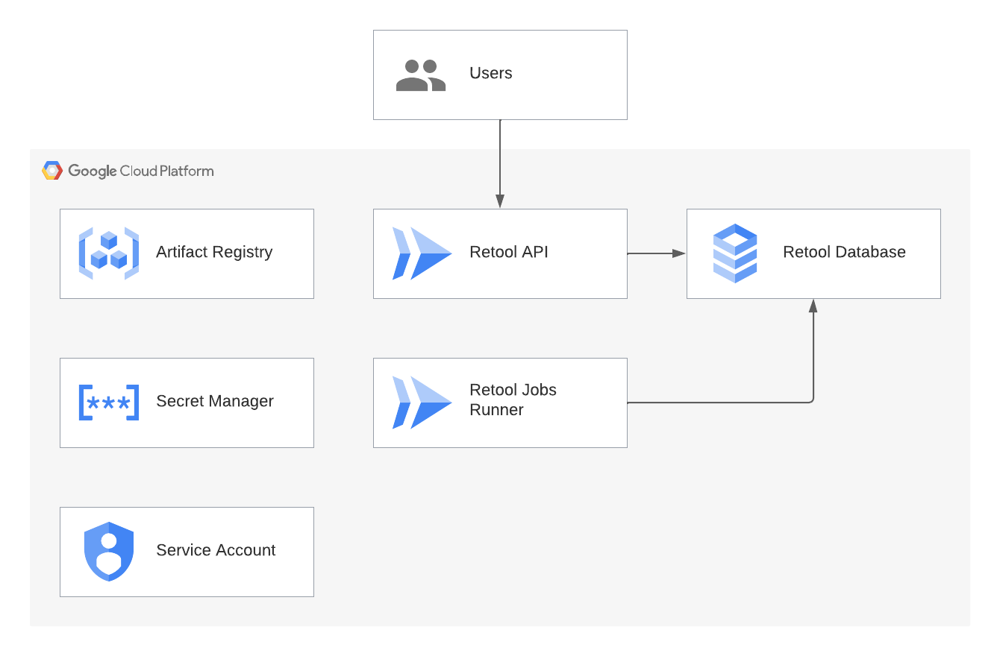

# Self-hosted Retool on GCP

[Self-hosted Retool](https://retool.com/self-hosted/) deployment on GCP backed by Cloud Run and SQL. Based on [examples from Retool](https://github.com/tryretool/retool-onpremise) and their [documentation](https://docs.retool.com/docs/self-hosted).



The purpose of this project is to run self-hosted Retool as cheap as possible in the cloud. This *is not intended for production use*, however, this code could serve as a base for a hardened deployment.

## Deployment Steps

- Create **terraform.tfvars** file with required variables.
- Run `terraform apply`.
- `terracurl_request.exec` will execute **retool-jobs-runner** Cloud Run job to apply database migrations.

### Sample Terraform .tfvars File

```hcl
project_id         = "your-project-id"
domain_name        = "retool.your-domain.com"
retool_image       = "docker.io/tryretool/backend"
retool_license_key = "retool-license-key"
```

## Known Issues

* The **retool-jobs-runner** job will show as failed due to the fact Cloud Run jobs are not designed to be long-running. The main purpose of this job is to run database migrations. After migrations are applied, the container will continue to run. You can verifiy the migrations have successfully run by searching the logs for `Running database migrations...` or `Database migrations are up to date.`. 

## Requirements

| Name | Version |
|------|---------|
| <a name="requirement_google"></a> [google](#requirement\_google) | 4.66.0 |
| <a name="requirement_terracurl"></a> [terracurl](#requirement\_terracurl) | 1.1.0 |

## Providers

| Name | Version |
|------|---------|
| <a name="provider_google"></a> [google](#provider\_google) | 4.66.0 |
| <a name="provider_random"></a> [random](#provider\_random) | 3.5.1 |
| <a name="provider_terracurl"></a> [terracurl](#provider\_terracurl) | 1.1.0 |
| <a name="provider_time"></a> [time](#provider\_time) | 0.9.1 |

## Modules

| Name | Source | Version |
|------|--------|---------|
| <a name="module_retool_api"></a> [retool\_api](#module\_retool\_api) | GoogleCloudPlatform/cloud-run/google | 0.7.0 |
| <a name="module_retool_database"></a> [retool\_database](#module\_retool\_database) | GoogleCloudPlatform/sql-db/google//modules/postgresql | 15.0.0 |
| <a name="module_retool_secrets"></a> [retool\_secrets](#module\_retool\_secrets) | GoogleCloudPlatform/secret-manager/google | 0.1.1 |
| <a name="module_retool_service_account"></a> [retool\_service\_account](#module\_retool\_service\_account) | terraform-google-modules/service-accounts/google | 4.2.0 |

## Resources

| Name | Type |
|------|------|
| [google_cloud_run_v2_job.retool_jobs_runner](https://registry.terraform.io/providers/hashicorp/google/4.66.0/docs/resources/cloud_run_v2_job) | resource |
| [google_project_service.activate_apis](https://registry.terraform.io/providers/hashicorp/google/4.66.0/docs/resources/project_service) | resource |
| [google_sql_user.retool_database_user](https://registry.terraform.io/providers/hashicorp/google/4.66.0/docs/resources/sql_user) | resource |
| [random_password.encryption_key](https://registry.terraform.io/providers/hashicorp/random/latest/docs/resources/password) | resource |
| [random_password.jwt_secret](https://registry.terraform.io/providers/hashicorp/random/latest/docs/resources/password) | resource |
| [random_password.password](https://registry.terraform.io/providers/hashicorp/random/latest/docs/resources/password) | resource |
| [terracurl_request.exec](https://registry.terraform.io/providers/devops-rob/terracurl/1.1.0/docs/resources/request) | resource |
| [time_sleep.wait_activate_apis](https://registry.terraform.io/providers/hashicorp/time/latest/docs/resources/sleep) | resource |
| [google_client_config.default](https://registry.terraform.io/providers/hashicorp/google/4.66.0/docs/data-sources/client_config) | data source |
| [google_secret_manager_secret_version.retool_database_password](https://registry.terraform.io/providers/hashicorp/google/4.66.0/docs/data-sources/secret_manager_secret_version) | data source |

## Inputs

| Name | Description | Type | Default | Required |
|------|-------------|------|---------|:--------:|
| <a name="input_activate_apis"></a> [activate\_apis](#input\_activate\_apis) | The list of APIs & services to activate within the project. | `list(string)` | <pre>[<br>  "compute.googleapis.com",<br>  "run.googleapis.com",<br>  "secretmanager.googleapis.com",<br>  "sqladmin.googleapis.com"<br>]</pre> | no |
| <a name="input_api_cpu"></a> [api\_cpu](#input\_api\_cpu) | Number of vCPUs allocated to each api container instance. | `string` | `"1000m"` | no |
| <a name="input_api_max_instances"></a> [api\_max\_instances](#input\_api\_max\_instances) | Maximum number of api container instances. | `number` | `1` | no |
| <a name="input_api_memory"></a> [api\_memory](#input\_api\_memory) | Memory to allocate to each api container instance. | `string` | `"2Gi"` | no |
| <a name="input_api_min_instances"></a> [api\_min\_instances](#input\_api\_min\_instances) | Minimum number of api container instances. | `number` | `0` | no |
| <a name="input_database_tier"></a> [database\_tier](#input\_database\_tier) | The machine type for the database instance. | `string` | `"db-f1-micro"` | no |
| <a name="input_database_version"></a> [database\_version](#input\_database\_version) | The database version to use. | `string` | `"POSTGRES_11"` | no |
| <a name="input_domain_name"></a> [domain\_name](#input\_domain\_name) | Verified domain name to map to api service. | `string` | `null` | no |
| <a name="input_image_name"></a> [image\_name](#input\_image\_name) | Artifact Registry container image name for Retool. | `string` | `"backend"` | no |
| <a name="input_jobs_runner_cpu"></a> [jobs\_runner\_cpu](#input\_jobs\_runner\_cpu) | Number of vCPUs allocated to the jobs-runner container instance. | `string` | `"1000m"` | no |
| <a name="input_jobs_runner_memory"></a> [jobs\_runner\_memory](#input\_jobs\_runner\_memory) | Memory to allocate to the jobs-runner container instance. | `string` | `"2Gi"` | no |
| <a name="input_project_id"></a> [project\_id](#input\_project\_id) | The project ID to deploy in. | `string` | n/a | yes |
| <a name="input_region"></a> [region](#input\_region) | The region of the deployment. | `string` | `"us-east1"` | no |
| <a name="input_repository_name"></a> [repository\_name](#input\_repository\_name) | Artifact Registry repository name. | `string` | `"retool"` | no |
| <a name="input_retool_image"></a> [retool\_image](#input\_retool\_image) | Retool image from docker.io or Artifact Registry. | `string` | `"docker.io/tryretool/backend"` | no |
| <a name="input_retool_license_key"></a> [retool\_license\_key](#input\_retool\_license\_key) | Retool license key. | `string` | `"EXPIRED-LICENSE-KEY-TRIAL"` | no |
| <a name="input_zone"></a> [zone](#input\_zone) | The zone of the deployment. | `string` | `"us-east1-b"` | no |

## Outputs

| Name | Description |
|------|-------------|
| <a name="output_url"></a> [url](#output\_url) | The DNS name of the Cloud Run service. |
